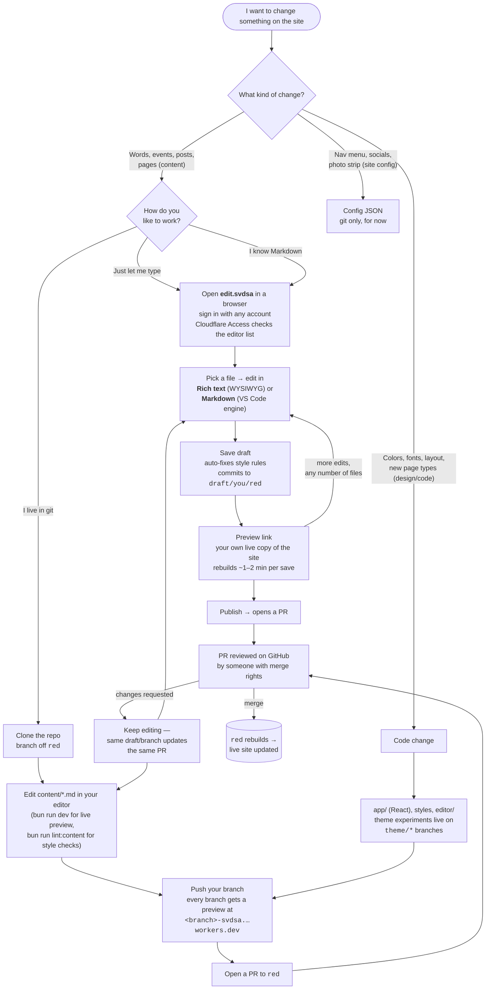

# How to edit siliconvalleydsa.org

Every change — from fixing a typo to redesigning the theme — flows through the
same git repository. What differs is the on-ramp. Find yourself on the ladder
below; each rung is optional and you can climb (or not) at your own pace.

## The rungs, in words

| You are…                 | You use…                                                                                                                                                                     | Your safety net                                                                                                                         |
| ------------------------ | ---------------------------------------------------------------------------------------------------------------------------------------------------------------------------- | --------------------------------------------------------------------------------------------------------------------------------------- |
| **WYSIWYG-only**         | [the editor](https://svdsa-edit.isozilla.workers.dev) in Rich text mode. No git, no Markdown, no accounts to create — sign in with whatever you have (Google, email OTP, …). | Nothing you do touches the live site. Saves go to your personal draft; Publish just _asks_ (opens a PR). Discard throws the draft away. |
| **Markdown-comfortable** | the same editor, Markdown mode (the VS Code engine — find/replace, multi-cursor).                                                                                            | Same draft/PR flow. Modes toggle losslessly, use both.                                                                                  |
| **Git-comfortable**      | a clone; edit `content/**/*.md` directly. One file per page/post/event; add a file to add content.                                                                           | Branch + PR. Every pushed branch gets its own full preview site.                                                                        |
| **Developer**            | `app/` (React Router), `editor/`, `scripts/`. Theme experiments on `theme/*` branches.                                                                                       | Same PRs, plus typecheck/tests/lint in the repo.                                                                                        |

Style rules (the San José é, inclusive language, …) live in
`content/config/style-rules.json` and apply to **everyone the same way**: the
editor auto-fixes what it can on every save and warns about the rest;
git users run `bun run lint:content` (`--fix` to apply).

Recurring events are ONE file with a `repeats:` rule (see
`scripts/expand-recurring.ts`); don't create per-date copies.

## Merge rights

`red` is the live site. Publishing only opens a PR — a reviewer with write
access merges it. That list is currently the tech working group; the
Cloudflare Access **editor list** (who can use the editor at all) is separate
and easier to join.
